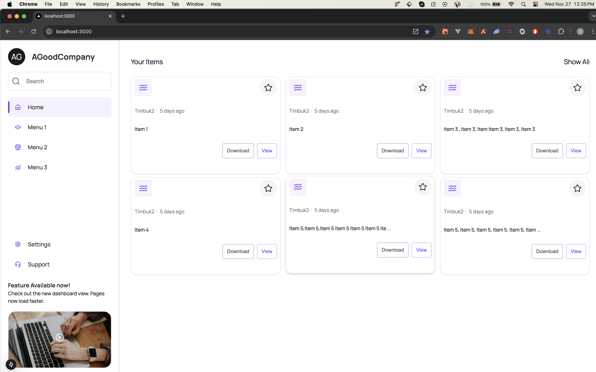
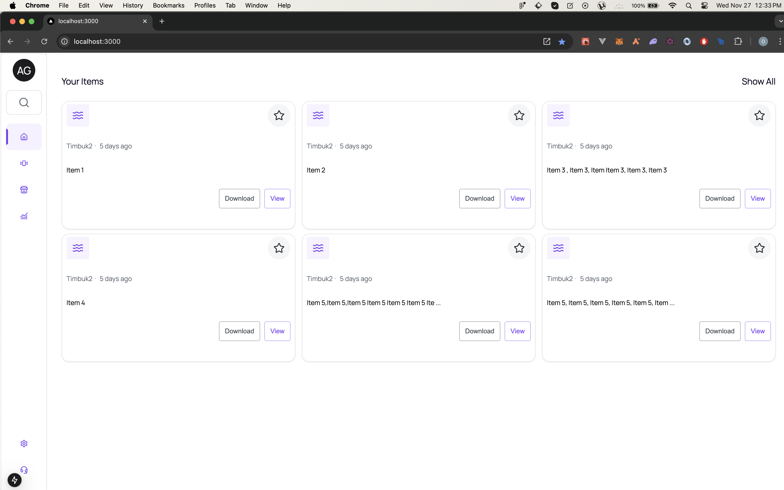

# AGoodCompany

This is a front-end application, written in nextjs with typescript, & styled-components.

First, run the development server:

```bash
git clone  git@github.com:domambia/agood-company.git && cd agood-company
npm install
# or
yarn install
# or
npm dev
# or
yarn dev
```

Open [http://localhost:3000](http://localhost:3000) with your browser to see the result.

## Current State

### Loading State


### Dashboard



### Minimized



### Mobile View


